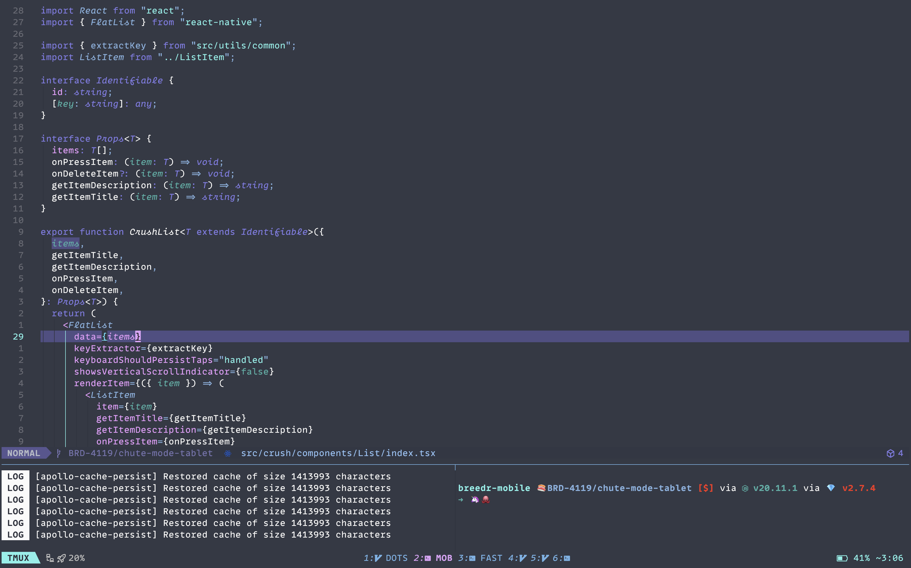
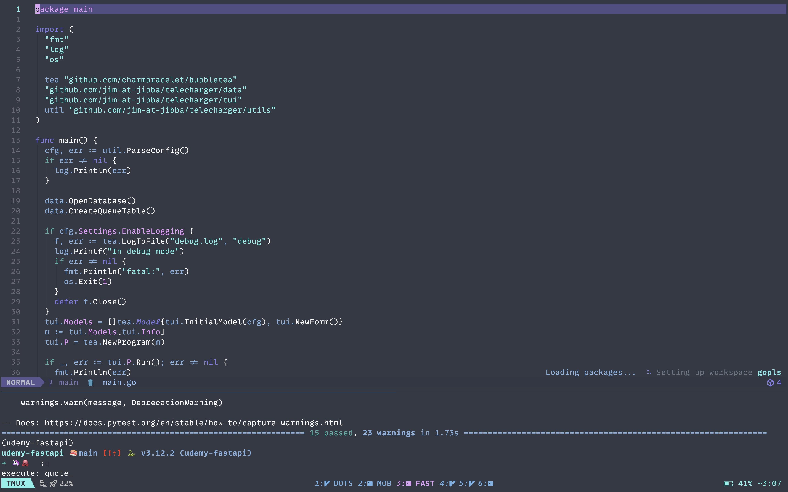
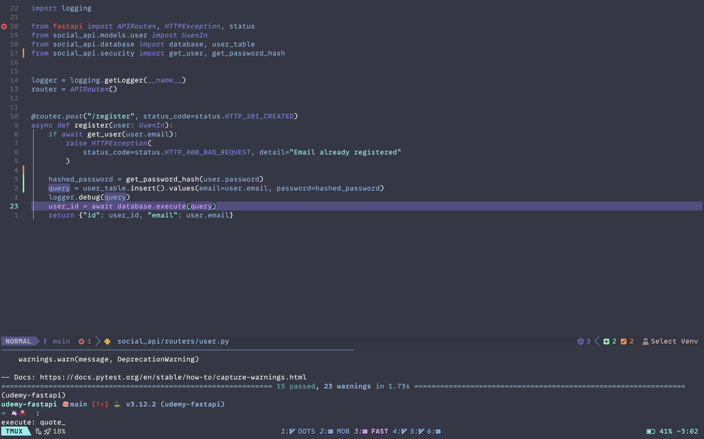
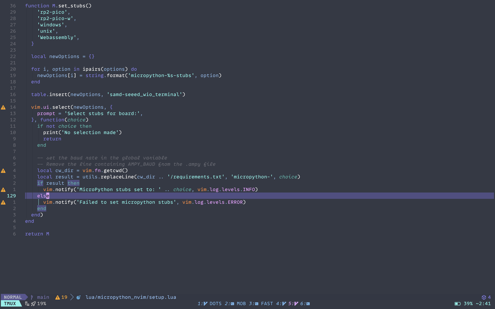

Custom fork of [ariake.nvim](https://github.com/jim-at-jibba/ariake.nvim), eg to make more distinction of modified buffers in MiniTabline, and set CursorLine to not override fg colour.

Beautiful, dark colour schema for Neovim

# Ariake



(Assets from original repo, not this fork.)

> Created with [colorgen](https://github.com/ChristianChiarulli/colorgen-nvim)


## Install

To install ariake.nvim you need a plugin manager.

- [Lazy.nvim](https://github.com/folke/lazy.nvim)

Example with Lazy.nvim

```lua
return {
    {
        'j-w-e/ariake.nvim',
        config = function ()
         vim.cmd.colorscheme 'ariake'
        end
    }
}
```

## Extra

In the extras folder there are Ariake theme files for:

- [Kitty](https://sw.kovidgoyal.net/kitty/)
- [Spacebar](https://github.com/cmacrae/spacebar)

## Examples

(Assets from original repo, not this fork.)





## Maintainers

See the main repo, [ariake.nvim](https://github.com/jim-at-jibba/ariake.nvim)

## License

[MIT License](./LICENSE)

